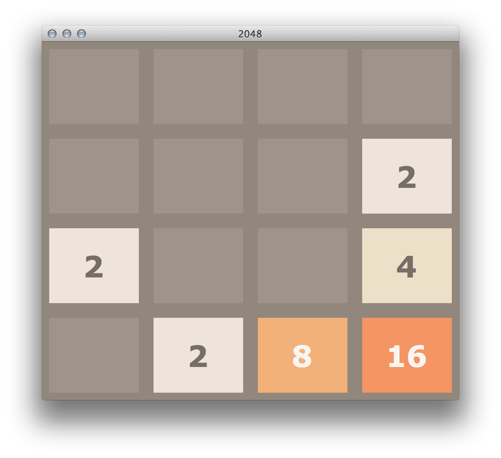

2048-python-AI
===========

[](https://repl.it/github/yangshun/2048-python)

Based on the popular game [2048](https://github.com/gabrielecirulli/2048) by Gabriele Cirulli. The game's objective is to slide numbered tiles on a grid to combine them to create a tile with the number 2048. Here is a Python version that uses TKinter and AI player! 




To start the game, run:

    $ python3 puzzle.py


To start the game with AI, run:

    $ python3 puzzleWithAI.py


There are `5` AI in `puzzleWithAI.py`:

- AI_Random: Decisions are random.
- AI_Rule1: All decisions base on specific rules.
- AI_EvaluationGreedy: Choose the best decision by evaluate state expection steps to lose by randomly play.
- AI_Expection: Choose the best decision by evaluate state expection steps to lose by evaluation function.
- AI_Expectimax: Search tree & AI_Expection & pruning.


the default AI is AI_Expectimax, which has best performance. To change the AI, please modify line 35 in `puzzleWithAI.py`:

- AI_Random:
``` python
self.after(self.intervalTime, self.AI_Random)
```
- AI_Rule1:
``` python
self.after(self.intervalTime, self.AI_Rule1)
```
- AI_EvaluationGreedy: 
``` python
self.after(self.intervalTime, self.AI_GreedyAndRule)
```

- AI_Expection:

```python
self.after(self.intervalTime, self.AI_Expection)
```

- AI_Expectimax (Default):

```python
self.after(self.intervalTime, self.AI_Expectimax)
```


GUI contributors:
==

- [Yanghun Tay](http://github.com/yangshun)
- [Emmanuel Goh](http://github.com/emman27)

AI contributor:
==

- [Yuhan Liu](http://github.com/)
