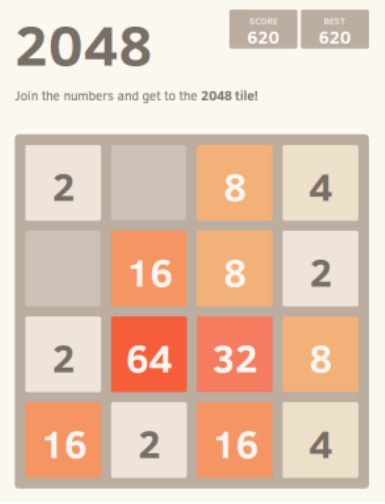
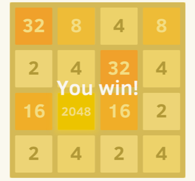
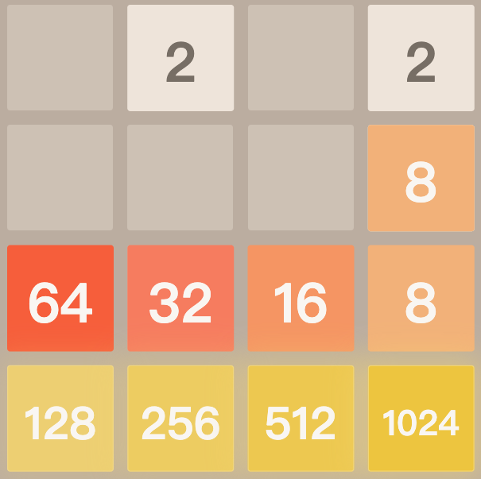
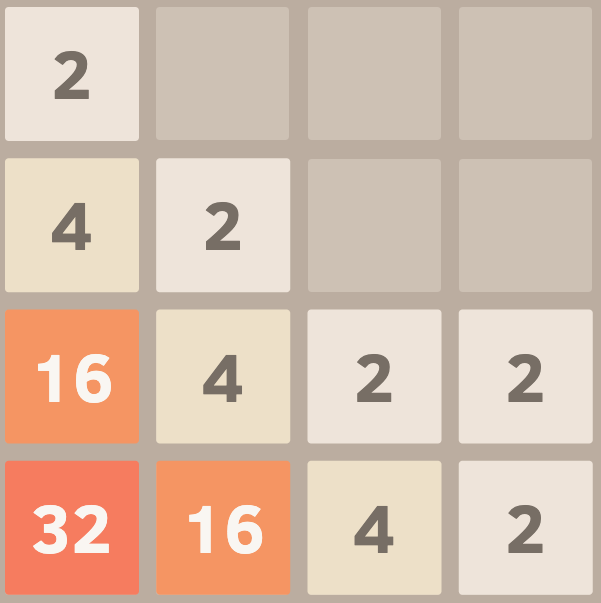
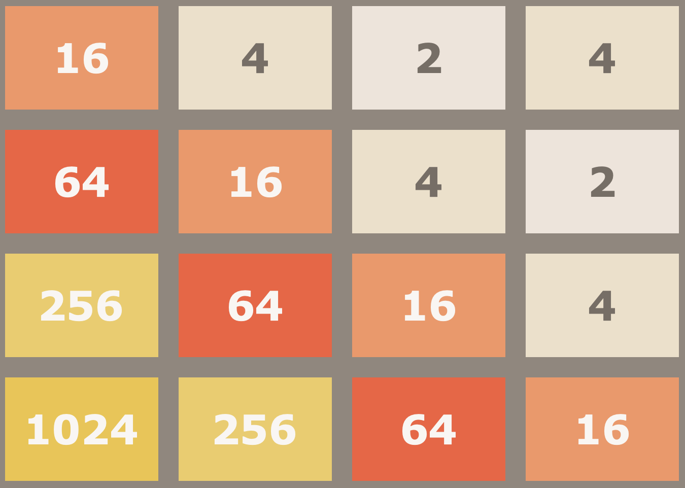
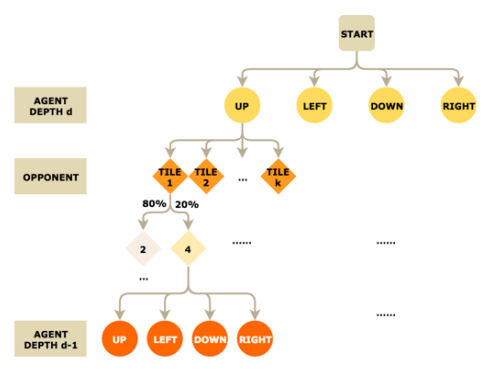

# 游戏 AI 算法设计—— 一个以问题求解为导向教学的例子

## 引言 

​	2048 是近年流行的数字游戏，本文以 2048 数字游戏的 AI 设计为题，介绍了博弈论的基础知识和 AI 的设计思路，深入浅出地让同学们了解博弈游戏的算法设计常见算法思路，并以实验的方式，具体地对比各算法之间的优劣。

## 2048 游戏介绍

​	2048 是一个单人数字游戏，玩家需要对 4x4 的数字方格矩阵做上、下、左、右的滑动操作。当两个数字方格中的数字相同，且被往相同方向滑动后相邻，则这两个数字方格合并为一个，且其数字变为原来两方块之和，并得到数值等于新方块数字的积分。每次滑动操作后，系统将按 10%，90% 的概率在其中一个空格中随机生成 4 或 2 两种之一的数字方格。对于经典版本的 2048 游戏，当产生数字为 2048 的方格时即为胜利，游戏结束；而进阶版本的 2048 游戏则无方块的上限，达到 2048 后游戏仍继续。当局面无法进行任何滑动操作时游戏结束。

图1，游戏界面

图2，游戏胜利局面

## 如何设计高分高效的 2048 AI

## 问题抽象

为了设计高分高效的 2048 AI，首先对问题进行抽象描述：

1. 记空格为 0 方格，则游戏局面可由 $4\times 4$ 的矩阵 $Mat$ 表示；
2. 记玩家的滑动操作分别为 UP， LEFT， DOWN， RIGHT；
3. AI 需要根据当前局面 $Mat$ 返回下一步的操作，即 UP， LEFT， DOWN， RIGHT 之一。

## 问题分析

根据之前的问题抽象，我们明确了 AI 的任务：根据当前局面 $Mat$ ，判断下一步的最优决策。

如何判断决策的优劣呢？不难想到，决策的优劣取决于决策后生成的局面的优劣。所以我们的首要任务是分析哪些局面是好的局面。

另外，由于新方格是随机产生的，因此相同的决策，产生的结果是多样的，产生的方块不同会使得局面优劣程度有变化。因此，如何统合分析不同的可能的局面，这也将是我们需要考虑的问题。

### 局面优劣性评估

我们首先考虑可以用哪些方式评估游戏局面的优劣性，评价方式常常有以下两种：基于经验的主观评价与基于概率期望的客观评价。

主观的评价即我们在大量游戏后自己总结出的主观经验，比如有的同学的经验为满足对角线上的单调性则最优，有的同学的经验为局面满足蛇形的单调性则最优等等，在同学的讨论后，可以总结为以下几种评判标准：

#### 单调性

单调性常常被分为两种类型的单调性，蛇形单调性和对角线单调性，如下图所示。

这两种单调性各有所长，因此我们尝试统合这两种单调性，即单独考虑每行每列的单调性：

$$ Monotonicity(Mat) = \sum_{i=1}^4 Monotonicity(Mat\_row[i]) + \sum_{i=1}^4 Monotonicity(Mat\_column[i])$$

这样，前述两种单调性均被统计到总体单调性之中了，现在考虑单行单列的单调性设计。

以下为两种单行单列单调性设计思路：

1. $$Monotinicity_1(Row) = max\{\sum_{i=1}^4 Row[i] * Weight[i],\ \sum_{i=1}^4 Row[i] * Weight[4 - i + 1]\}$$

2. $$Monotinicity_2(Row) = max\{\sum_{i为Row的极长不降子串} length(i)^2, \sum_{i为Row的极长不升子串} length(i)^2\}$$

实验证明第二种计算方式有更好的效果。

#### 平滑性与空格数

单调性不能完全描述局面的优劣，以下为一个满足单调性但仍然失败的例子：

同学们分析讨论以上例子后，可以得出结论：局面的平滑性和有充足的空格数是很重要的。

平滑性是指每个方块与其直接相邻方块数值的差，其中差越小越平滑。例如 2 与 4 相邻比 2 与 128 相邻更平滑。一般认为越平滑的格局越有利于方格的合并，局面越优。以下为平滑性评估函数的设计思路：

$$Smoothness(Mat) = -\sum_{i=1}^4 \sum_{j=1}^4 \min_{k为与(i,j)相邻格子的值} |Mat(i,j) - Mat(k)|$$

空格数过少往往是导致失败的原因之一。空格数过少会导致局面的灵活性变差，同时会导致可选操作数量的减少，因此我们要对空格数过少的局面设置惩罚函数：

$$Space(Mat) = -(16 - \sum_{i=1}^4 \sum_{j=1}^4 [Mat(i,j) == 0])^2$$

#### 随机落子法评估

和以上的评估方法不同，随机落子法不需要设计任何主观的估价函数。

随机落子法每一次对当前局面不断地随机操作，直到游戏结束。重复 k 次（本文 $k=50$）取结束时得分的平均值即为该局面的随机落子估价。

$$Random(Mat) = \frac{\sum_{i=1}^k PlayRandomlyScore(Mat)}{k}$$

这种基于实验统计的方法是有效的，因为我们的 “对手” 随机地生成新的 2 或 4 的方块，这种双方均为随机落子的情况下，此分数可以有效地反映局面的优劣程度。另外，如果游戏中生成新方块的方式是根据当前局面，选择令我们最难赢的一种方块生成方式的话，则随机落子法无法单独使用，需要搭配蒙特卡洛搜索树才可发挥作用。

最终的估价函数为：

$$Evaluation(Mat) = k_1 * Monotonicity(Mat) + k_2 * Smoothness(Mat) + k_3 * Space(Mat) + k_4 * Random(Mat)$$

### 决策与搜索算法

决策的优劣是由决策后局面的优劣所决定的，而一个决策由于系统随机生成新方块的不同会导致后续局面的不同。因此我们需要使用搜索的方式计算决策后局面的期望优劣程度。另外，我们之前的估价函数只能粗略的描述一个局面的优劣，若需要更精细化地描述一个局面的优劣程度，则需要搜索局面的后续决策与局面。下为搜索树的示意图：

在搜索树中，对于叶子结点，局面的分数即为其评估函数；对于非叶子结点，我们对每个局面的下个决策进行搜索，再搜索下一个方块生成的位置，得到后继局面，决策的分数即为其后继局面的分数的期望，选择分数期望最大的决策作为下一步决策。

我们的决策方式依赖于系统的生成新格子是随机的，如果游戏中生成新方块的方式是根据当前局面，选择令我们最难赢的一种方块生成方式的话，则需要使用  MinMax 搜索树算法，这个算法的流程如下：在搜索树中，对于叶子结点，局面的分数即为其评估函数；对于非叶子结点，我们对每个局面的下个决策进行搜索，再搜索下一个方块生成的位置，得到后继局面，决策的分数为其后继局面的分数的最小值，选择分数最大的决策作为下一步决策。不难发现，此算法往往适用于两方均以获胜为目的的零和博弈游戏中，但在 2048 游戏中，这个算法过于保守。

出于对搜索效率的考量，我们需要考虑剪枝：对所有概率过小 (本文取 $< 10^{-6}$) 的局面的搜索节点，直接返回评分为0。这样可以减少计算量的同时，提高搜索效率。

## 算法效率测试

以上讨论中有以下参数需要调整：$k_1,k_2,k_3,k_4,$ 搜索深度 $depth$，我们做了下述实验，每组实验进行100次测试。测试程序在附录中，现场时向同学直观地展示运行结果，效率的对比非常明显。

|       | $k_1=0,k_2=k_3=0,k_4=1$ | $k_1=k_2=k_3=0.1,k_4=0,depth=3$ | $k_1=0.4,k_2=k_3=0.1,k_4=0,depth=3$ |
| ----- | ----------------------- | ------------------------------- | ----------------------------------- |
| 1024  | 100%                    | 100%                            | 100%                                |
| 2048  | 62%                     | 97%                             | 99%                                 |
| 4096  | 13%                     | 37%                             | 78%                                 |
| 8192  | 0%                      | 2%                              | 36%                                 |
| Times | 极慢                    | 快                              | 快                                  |

我们发现第三组最优，因此我们取 $k_1=0.4,k_2=k_3=0.1,k_4=0$，对搜索层数进行进一步的测试。

|       | $depth=3$ | $depth=4$ | $depth=5$ | $depth=3 + \lfloor x/5\rfloor$ |
| ----- | --------- | --------- | --------- | ------------------------------ |
| 1024  | 100%      | 100%      | 100%      | 100%                           |
| 2048  | 99%       | 100%      | 100%      | 100%                           |
| 4096  | 78%       | 88%       | 97%       | 93%                            |
| 8192  | 36%       | 51%       | 81%       | 77%                            |
| Times | 快        | 很慢      | 极慢      | 慢                             |

其中 x 为当前局面中不同的数字数量，我们发现当 x 比较小时，局面往往比较简单，搜索层数可以减少；x 比较大时，局面往往非常复杂，需要提高搜索层数。通过动态地调整搜索层数，可以在提高效率的同时确保算法决策的可靠性。

我们的测试程序为方便学生阅读与便于图形化展示使用 python 编写，因此测试程序效率不高。使用 c++ 等更高效的语言以及位运算优化可以极大减少 AI 的时间复杂度常数，在相同时间内得到更好的结果。

## 参考文献

[1] https://stackoverflow.com/questions/22342854/what-is-the-optimal-algorithm-for-the-game-2048

[2] 李晓明; 有向图的增强——一个适合以问题求解为导向教学的例子[J]. 计算机教育, 2019, 02: 1-4

## 附录

2048 AI 与游戏图形界面 https://github.com/jszyxw/2048AI